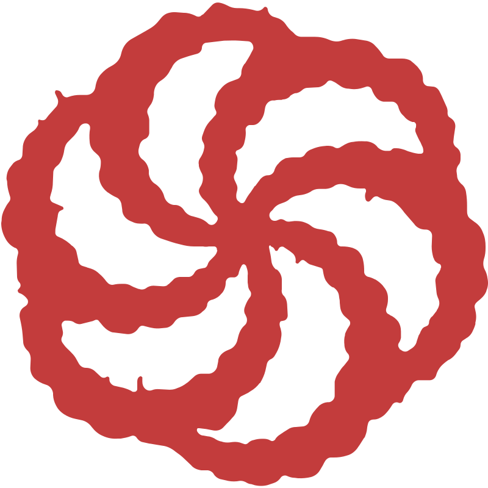

## Hi there 👋, I'm Yaroslav, or just Yarik!

 
 
I am a responsible and diligent team player with 3 years of experience in development. I have worked on both large and complex projects that have been in existence for many years, as well as on creating projects from scratch. I am quick to learn and strive to adapt to new work environments as soon as possible. I am always open and ready for new opportunities and challenges in my work
 
 

  
### 🧐 More About Me:

- 🔭 &nbsp; I’m currently working at <a href='https://github.com/kanini'>
 Kanini Software Solutions Ukraine</a>
- 📫 &nbsp; Feel free to ping me on [LinkedIn](https://www.linkedin.com/in/yaroslav-khazivaliev/)
<!-- - 📝 &nbsp; Checkout my [resume] -->
- 📚 &nbsp; In my free time, I play tennis with friends 🎾, study world history ⛩️, and improve my skills in both English and Spanish 🗿.

 

### 🔨 Languages and Tools:

 

### 📊 Github Stats

</a>

 
